## Hi i'm Takahiro Hayasaka 👋

 

***

I am an engineer at [Members Co., Ltd.,](https://www.members.co.jp/) working on application development using Dart/Flutter. 🎯

I rarely develop software myself. 🫤

Please see here for more information about our company [specializing in app development](https://crossapplication.members.co.jp/).

I would like to contribute to the Dart/Flutter community, however small my contribution may be. 💪

<!--
**eg-t-hayasaka/eg-t-hayasaka** is a ✨ _special_ ✨ repository because its `README.md` (this file) appears on your GitHub profile.

Here are some ideas to get you started:

- 🔭 I’m currently working on ...
- 🌱 I’m currently learning ...
- 👯 I’m looking to collaborate on ...
- 🤔 I’m looking for help with ...
- 💬 Ask me about ...
- 📫 How to reach me: ...
- 😄 Pronouns: ...
- ⚡ Fun fact: ...
-->
